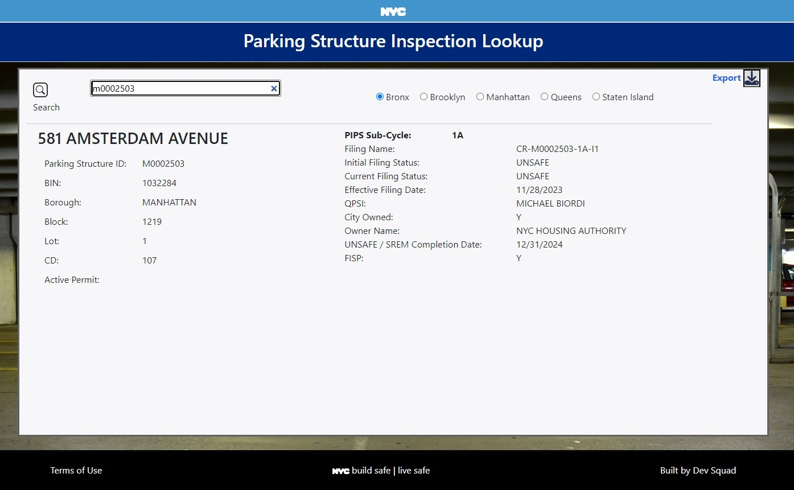

# Parking History 
Current Stage: Alpha

Try it out: [Parking History](https://cathycodes.github.io/alphahist/alphapark.html)

## Features

### Search
  
  -Three ways to search:

    * 7-digit BIN, e.g. *1008086*
    * 8-character Parking Structure ID (PSID), e.g. *M0002448*
    * Address as House # + Street Name and Borough, e.g. *46 King Street*
      For Address, you must selected the Borough
      
  -Duplicate Parking Structure Filter
  
    What makes a duplicate?  A Street Address+Borough or a BIN that has more than 1 unique Parking Structure ID (PSID).
    
    User gets a list of probable structures from which to select.
    
    
### Export

  -File name: ParkingStructureInspections_yyyymmdd.csv
  
  -Includes only **ACTIVE** and **ACCEPTED** data
  
  -Columns
-	Parking Structure ID
-	Filing Name
-	Filing Status
-	House  Number
-	Street Name
-	BIN
-	Block
-	Lot
-	Borough
-	C.B. No.
-	QPSI  (Qualified Parking Structure Inspector)
-	Filing Type
-	UNSAFE / SREM Completion Date
-	Effective Filing Date
-	PIPS Cycle
-	PIPS Sub-Cycle
-	DOF Bldg Classification Description
-	City Owned
-	Report Status
-	ActiveStructuralPermit
-	FISP
-	LAT
-	LONG
  

Please help improve this tool by sending your questions, comments, and suggestions.

Regards, 

**CathyCodes** (*It's What I Do*)
